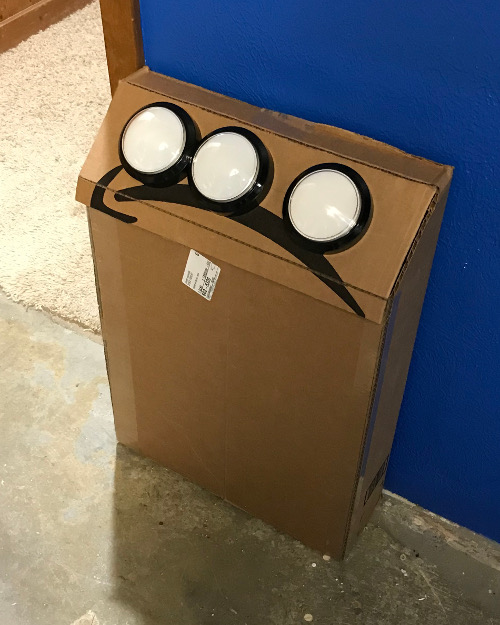

# juke-bot
Durable, simple jukebox for kids

This project needs:

 - A Raspberry Pi (I'm using a late 2013 model, so anything but a Zero)
 - An SD card big enough to hold [Raspbian Lite](https://www.raspberrypi.org/downloads/raspbian/) and your music.
 - Some speakers that plug into your Raspberry Pi's speaker jack.
 - Power. I'm using a [two-port high-amperage USB wall charger](https://www.amazon.com/gp/product/B013US9FFY/ref=oh_aui_search_detailpage?ie=UTF8&psc=1) to power the Pi and the speakers.
 - Three durable buttons. I'm using these [big 4" light-up buttons](https://www.amazon.com/gp/product/B071FSKY6Q/ref=oh_aui_detailpage_o00_s00?ie=UTF8&psc=1).
 - An enclosure. I'm prototyping in a cardboard box, but will upgrade to plywood.
 - Some way to easily wire into the Pi's GPIO ports. I'm using the [Adafruit T-Cobbler](https://www.adafruit.com/product/2028) to a breadboard at the prototyping stage.
 - Some way to connect to the buttons. The microswitches on those huge buttons will take normal spade connectors, but the connectors to the LEDs are too wide, so I'll have to figure something else out.
